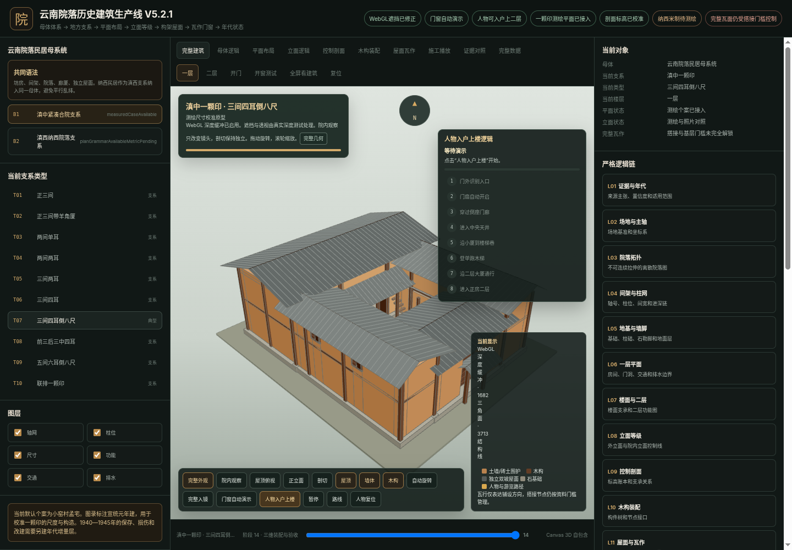

# 云南院落历史建筑生产线 V5.4.1

这是当前稳定的全量本地工程。默认页面直接显示完整的一颗印建筑，使用 WebGL 深度缓冲处理旋转遮挡，并包含门窗自动开合、人物入户、穿过倒座、进入天井、沿小厦到楼梯巷、登上二层大厦的演示。



## 快速打开

最稳妥的本地方式是启动静态服务器：

Windows 双击 `START_LOCAL_WINDOWS.bat`。

Windows PowerShell 运行 `./START_LOCAL_WINDOWS.ps1`。

macOS 或 Linux 运行 `./start_local_mac_linux.sh`。

也可以直接打开 `index.html`。部分浏览器对本地文件的权限策略较严格，遇到加载或交互限制时使用本地服务器。

## GitHub 上传

直接上传 GitHub 时，优先使用同批交付的 `github-ready.zip`。它已经排除本地参考图片和临时文件。

命令行推送可以运行：

```powershell
./PUSH_TO_GITHUB.ps1 -RepoUrl "你的仓库地址"
```

或：

```bash
./push_to_github.sh "你的仓库地址"
```

仓库推送到 `main` 后，内置 GitHub Pages 工作流会先执行静态验证，再发布 `index.html`。第一次部署前需要在仓库 Settings 的 Pages 页面把 Source 设为 GitHub Actions。公开生产线中的“GitHub同步”入口会读取仓库最新数据、提交和 `[Web Sync]` Issue；网页端命令与现场记录可先留在本地队列，也可由用户主动用 Fine-grained token 提交为 Issue，形成可审计的回传链路。

## 当前稳定能力

1. 一颗印完整院落默认入镜。
2. WebGL 深度测试解决旋转时的错误穿面。
3. 院内观察只改变镜头，剖切单独控制。
4. 双扇大门、正房上层门和四组高窗可以自动开合。
5. 人物可以进入天井并沿楼梯到达二层。
6. 滇中一颗印与滇西纳西民居归入云南院落民居母系统。
7. 平面、间架、剖面、屋面、门窗和交通逻辑保存在独立 JSON 数据中。
8. 页面为单文件自包含版本，不依赖外部 CDN。
9. 新增“云南民居三开间带前廊两层建筑”测绘个案：11.53 m 面阔、7.92 m 进深、1.87 m 前廊、2.85 m 二层与 7.04 m 屋脊。
10. 个案按四副横向梁架生成，两山穿斗式、中间两副抬梁式；主体悬山与前廊披檐保持独立。
11. 单片收分板瓦/筒瓦已在本地 WebGL 的屋顶、檐口、正立面和人眼入口视角完成复查；楼梯沿用已确认的 8+8 级双跑日常木梯。
12. 已将用户确认来自团结乡的完整院落扫描登记为 `YN_TUANJIE_001`（旧别名“民居 C2 美人靠”）：Lite/High GLB、源 FBX/贴图、样本拆分、尺度证据边界和资产契约均可回溯；它作为参考观察层，不替代程序化构件。
13. 已建立团结乡连续样本登记规则，后续建筑按稳定编号追加；当前 GLB 包围盒只作展示尺度，真实尺寸须由测绘控制点校准。
14. “团结乡样本”页提供同一套 48 网格扫描几何的双档 GLB：`YN_TUANJIE_001_EDITABLE_HIGH.glb` 保留 7000×7000 底色和 2500×2500 法线，`YN_TUANJIE_001_EDITABLE.glb` 保留 3072×3072/1024×1024 网页标准贴图；两档均按场地、未定细部、一层、二层和屋顶建立可编辑父分组。
15. 修复直接双击 `index.html` 时浏览器阻止 `file://` 读取 GLB 而显示空白的问题：查看器始终可见，本地模式可选择或拖入下载后的 GLB；通过启动脚本访问时仍可一键读取内置主档。
16. 团结乡查看器现读取并应用内嵌法线贴图，启用各向异性纹理过滤和最高 2.5 倍设备像素比；界面明确显示当前实际载入档位、贴图分辨率和扫描源固有破边边界。

## 工程目录

```text
index.html                         当前稳定网页
404.html                           GitHub Pages 回退页
.github/workflows/                 自动验证与 Pages 部署
data/                              当前系统、类型、构件、交互和验收数据
docs/                              架构、工作法、部署、验收和后续路线
qa/screenshots/                    当前版本和建筑逻辑检查图
tools/                             本地启动、验证、浏览器冒烟测试和打包工具
references-private/                用户提供的研究资料，本地保留，Git 默认忽略
threejs/                           Three.js 3GIS 参考资产加载入口与清单
AGENTS.md                          Codex 与后续开发窗口的强制规则
PROJECT_STATE.md                   当前项目状态与下一步
```

## 先运行验证

```bash
python tools/validate.py
```

可选浏览器测试：

```bash
python -m pip install -r requirements-dev.txt
python -m playwright install chromium
python tools/browser_smoke_test.py
```

## 当前资料边界

板瓦与筒瓦已依据用户提供的本地草测图建立为有大小口收分的单片曲面实体：板瓦凹面朝上居下，筒瓦凸面朝上逐片压缝。坡向露明量按用户实景照片作视觉校准，不冒充实测搭接尺寸；精确纵向搭接、泥背厚度、檐口固定与屋脊端部仍待节点图锁定。传统窗扇的地方五金与精确开启方式仍待近照和节点图校准。纳西支系已经具有平面类型与楼型语法，完整米制测绘模型仍待资料补齐。三开间前廊个案的地点、年代和族属尚未由资料确定。

## 参考图片与版权

`references-private/` 保存本地研究资料，默认写入 `.gitignore`。公开仓库上传前请核实图片版权、引用条件和署名。网页运行不依赖这些图片。

`references-private/c2-meirenkao/` 保存团结乡样本 01 的源 FBX、贴图和 GLB，目录名作为旧资产兼容路径保留。当前生产线页面仍保持无外部依赖的程序化 WebGL 展示；Three.js 3GIS 宿主可按 `threejs/C2MeirenkaoAsset.js` 加载该参考层。团结乡系列登记册见 `docs/TUANJIE_TOWNSHIP_REFERENCE_REGISTER.md`。

## 许可

本包没有预设开源许可证。公开发布、协作或商业使用前，请由项目所有者选择并加入合适的许可证。
